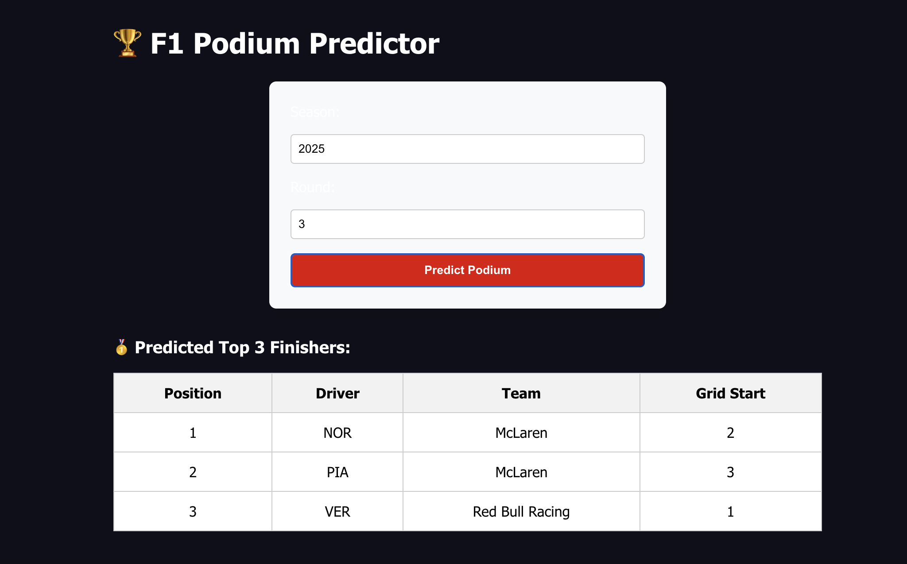
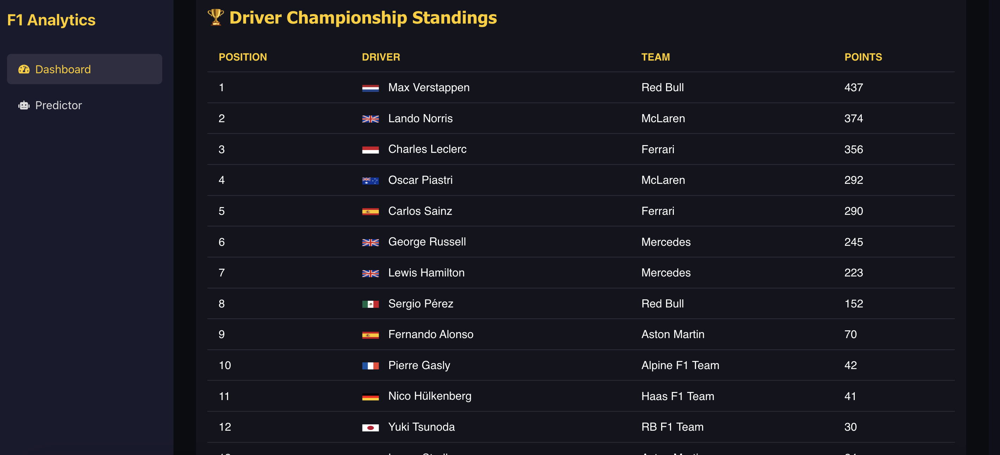

# 🏎️ F1 Analytics Predictor

An interactive web app to predict Formula 1 podium finishes and visualize driver & team performance using real-time and historical data.

---

## 🚀 Features

- 🔮 Predict top 3 race finishers based on qualifying performance (ML ranking model)
- 📈 Visualize driver & constructor points progression
- 🏁 View race results, standings, and position changes
- 🎨 Responsive React UI with charts, dropdowns, and dashboards
- ⚙️ FastF1-powered backend using Flask
- 🧠 Machine learning model trained on 2000–2024 race data

---

## 🧱 Tech Stack

| Frontend        | Backend        | ML / Data         |
|-----------------|----------------|-------------------|
| React + Axios   | Python + Flask | LightGBM (Ranker) |
| Recharts        | FastF1 API     | pandas + joblib   |

---

## 📸 Screenshots

| Podium Predictor | Driver Points Chart |
|------------------|---------------------|
|  |  |

---

## 🧠 Machine Learning Model

### 🔍 Problem Statement

We aim to predict the **top 3 finishers** (podium positions) in a Formula 1 race **before the race**, using qualifying data — particularly Q3 results. The problem is framed as a **ranking task**, where each driver is scored and the lowest three are selected as podium finishers.

---

### ⚙️ Model Overview

| Model Used     | Type             | Library   |
|----------------|------------------|-----------|
| LightGBM Ranker | Learning-to-rank | LightGBM  |

We use LightGBM's `lambdarank` algorithm because it:

- Supports ranking tasks out of the box
- Is efficient with large datasets
- Is easy to train and deploy
- Performs well with limited features

---

### 📊 Features Used

| Feature         | Description                                |
|-----------------|--------------------------------------------|
| `grid`          | Starting grid position of the driver       |
| `constructorId` | Numeric ID representing the constructor     |
| `q1_seconds`    | Q3 lap time in seconds                      |

📌 **Note:** Only drivers with valid Q3 times are included for accurate predictions.

---

### 🧪 Model Training Details

#### 📁 Dataset
- Based on Kaggle’s Formula 1 dataset (1950–2024)
- Filtered to include only seasons from **2000 to 2024**
- Joined: `results.csv`, `qualifying.csv`, `drivers.csv`, `constructors.csv`, `races.csv`

#### 🧹 Preprocessing
- Dropped rows with missing values in required columns
- Converted lap times (timedelta) to seconds
- Kept only drivers who reached Q3

#### 🧪 Train-Test Split
- Split by `raceId` to simulate real-time race prediction
- 80% of races for training, 20% for testing

---

### 📈 Evaluation Metrics

| Metric             | Description                                  | Value (Sample) |
|--------------------|----------------------------------------------|----------------|
| **MAE**            | Mean Absolute Error of predicted positions   | ~11.5          |
| **RMSE**           | Root Mean Squared Error                      | ~12.9          |
| **Kendall’s Tau**  | Rank correlation between predicted & actual  | ~0.33          |
| **Top-3 Accuracy** | % of correctly predicted podium finishers    | ~43%           |

---

### 💾 Saved Model

- **Filename:** `top3_rank_predictor.pkl`
- **Location:** `/server/ml_models/`
- **Loaded by:** Flask backend at startup
- **Endpoint:**  
  `GET /api/ml/predict-top3/rank-model?year=YYYY&round=ROUND`

---

### 🔄 Future Improvements

- Add driver & team performance trends
- Integrate track/weather conditions
- Use ensemble methods or neural nets
- Add real-time post-quali updates
- Display podium prediction confidence

---

## 🔧 Getting Started

### 1. Clone the Repository

```bash
git clone https://github.com/your-username/f1-analytics-predictor.git
cd f1-analytics-predictor


### 2. Install Dependencies

Frontend:

cd client
npm install
npm start

Backend:

cd server/fastf1
python -m venv venv
source venv/bin/activate
pip install -r requirements.txt
python app.py

📡 API Endpoints
GET /api/ml/predict-top3/rank-model
Predict podium using qualifying data from FastF1 (Q3 only).

Query Params:

year: Season year (e.g. 2025)

round: Round number (e.g. 3)

Returns:


[
  { "position": 1, "driver": "VER", "team": "Red Bull", "grid": 1 }
]

# 📂 Folder Structure
bash
Copy
Edit
client/          # React frontend
server/fastf1/   # Flask backend + ML model
ml/              # Training scripts + data
public/          # Static assets

### 🧹 Cleanup Notes
✅ Removed unused FastF1 controller (Node)

✅ Removed placeholder Firebase/socket files

✅ Uses live team names from FastF1 (no outdated JSONs)

✅ Loads Q3 only for better podium prediction

### 📘 Credits
FastF1 – F1 data API

Ergast API – Historical F1 results

LightGBM – Ranking-based ML model

### 📜 License
MIT — Feel free to fork, extend, and build on it!

### 🙌  Contributions Welcome
Have a feature in mind or want to refine the ML model? PRs are always welcome!

Let me know if you'd like:
- a lighter minimal version
- deploy instructions (e.g. for Vercel + Flask backend)
- GitHub action to auto-train ML model on new data

You’re basically race-ready 🏁🔥

